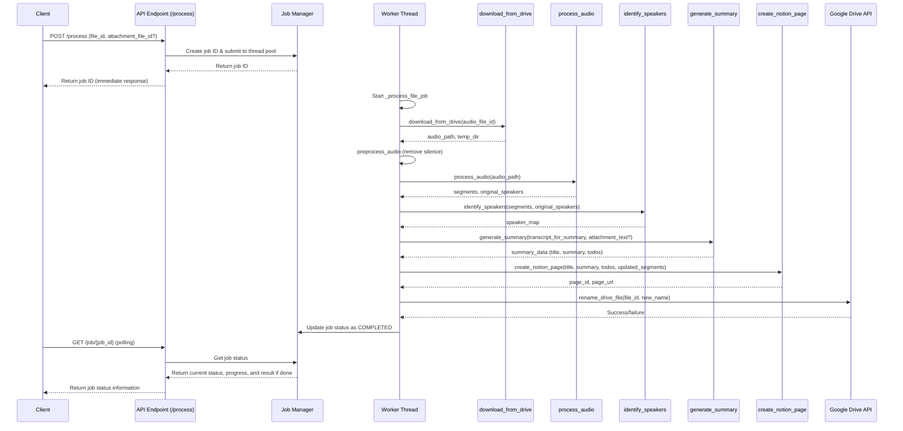

# Audio Processor - Detailed Workflow

This document provides a detailed explanation of the audio processing workflow implemented in `app.py`.

## Overview

The application receives a Google Drive file ID for an audio file (and optionally, a PDF attachment file ID) via an API endpoint. It then performs the following steps:

1.  Downloads the audio file (and attachment if provided).
2.  Extracts text from the PDF attachment (if applicable).
3.  Preprocesses the audio file to remove silence.
4.  Converts the audio file to a standard WAV format.
5.  Transcribes the audio using Whisper.
6.  Performs speaker diarization using Pyannote.
7.  Attempts to identify speaker names using Google Gemini.
8.  Generates a title, summary, and to-do list using Google Gemini, incorporating the transcript, identified speakers, and optional attachment text.
9.  Creates a new page in a Notion database containing the generated summary, to-dos, and the full transcript with identified speaker names and timestamps.
10. Renames the original audio file in Google Drive to include the generated title.

The application now processes files asynchronously using a thread pool, allowing it to handle multiple requests simultaneously.

## Main Workflow

The core logic now resides in the `_process_file_job` function which executes in a background thread. Here's an updated sequence diagram illustrating the flow:

## Function Details

### New Functions

#### `process_file_async(file_id, attachment_file_id)`

*   **Purpose:** Creates an asynchronous job for file processing and returns a job ID.
*   **Input:** `file_id` (string), `attachment_file_id` (optional string).
*   **Process:**
    1.  Generates a unique job ID using `uuid.uuid4()`.
    2.  Creates a job entry with initial status "pending" and stores it in the `jobs` dictionary.
    3.  Submits the `_process_file_job` function to the thread pool with the job ID and file IDs.
*   **Output:** `job_id` (string) - A unique ID for tracking the job.
*   **Error Handling:** Any exceptions are caught in the API endpoint and returned as errors.

#### `_process_file_job(job_id, file_id, attachment_file_id)`

*   **Purpose:** Background worker function that processes the audio file and updates job status.
*   **Input:** `job_id` (string), `file_id` (string), `attachment_file_id` (optional string).
*   **Process:**
    1.  Updates job status to "processing" and sets progress to 5%.
    2.  Processes the file with regular status updates at key milestones.
    3.  Upon completion, updates job status to "completed" and stores result.
    4.  If an error occurs, updates job status to "failed" and stores error information.
*   **Output:** Result dictionary (not directly returned but stored in job record).
*   **Error Handling:** Catches all exceptions, logs them, and updates job status to "failed".

#### `get_job_status(job_id)`

*   **Purpose:** Retrieves the current status and details of a processing job.
*   **Input:** `job_id` (string) - The unique job ID.
*   **Process:**
    1.  Retrieves the job record from the `jobs` dictionary.
    2.  Returns appropriate information based on job status.
*   **Output:** Dictionary with job details including status, progress, and results if completed.
*   **Error Handling:** Returns error information if the job ID is not found.

#### `preprocess_audio(audio_path)`

*   **Purpose:** Preprocesses audio to improve processing efficiency by removing silence.
*   **Input:** `audio_path` (string) - Path to the audio file.
*   **Process:**
    1.  Loads the audio file using librosa.
    2.  Detects non-silent intervals using librosa.effects.split.
    3.  Creates a new audio file containing only the non-silent segments.
    4.  Calculates time savings from silence removal.
*   **Output:** `processed_path` (string) - Path to the processed audio file.
*   **Error Handling:** Returns the original path if preprocessing fails or if no non-silent segments are detected.

#### `rename_drive_file(file_id, new_name)`

*   **Purpose:** Renames a file in Google Drive using the Drive API.
*   **Input:** `file_id` (string) - Google Drive file ID, `new_name` (string) - New filename.
*   **Process:**
    1.  Calls the Drive API files().update method with the new name.
    2.  Logs the success or failure.
*   **Output:** `success` (boolean) - True if renaming succeeded, False if it failed.
*   **Error Handling:** Catches and logs API exceptions, returning False on failure.

#### `format_timestamp(seconds)`

*   **Purpose:** Converts a time value in seconds to a readable timestamp format.
*   **Input:** `seconds` (float) - Time in seconds.
*   **Process:**
    1.  Converts seconds to hours, minutes, seconds format.
    2.  Returns a formatted string.
*   **Output:** `timestamp` (string) - Formatted timestamp (MM:SS or HH:MM:SS).

### Modified Functions

#### `create_notion_page(title, summary, todos, segments, speaker_map, file_id)`

*   **Purpose:** Creates a new page in a pre-configured Notion database.
*   **Input:** `title` (string), `summary` (string), `todos` (list of strings), `segments` (list of dictionaries), `speaker_map` (dictionary), `file_id` (optional string).
*   **Process:**
    1.  Retrieves Notion API token and Database ID from environment variables.
    2.  If file_id is provided, gets file info and adds a link to the source file.
    3.  Constructs the Notion page content as a list of blocks.
    4.  Uses a batch processing approach to handle the Notion API's 100-block limit per request:
        *   First creates a page with essential content (metadata, participants, summary, to-dos)
        *   Then appends transcript segments with timestamps in batches of up to 100 blocks per request
    5.  Sends requests to the Notion API endpoints.
*   **Output:** `(page_id, page_url)` (tuple) - The ID and URL of the newly created Notion page.
*   **Error Handling:** Raises exceptions on Notion API errors, logging response details. Handles batch failures gracefully, continuing with subsequent batches.

#### `load_models()`

*   **Purpose:** Lazily loads AI models to save memory until they are needed.
*   **Input:** None.
*   **Process:**
    1.  Checks if models are already loaded to prevent redundant loading.
    2.  Loads the Whisper model for speech-to-text transcription.
    3.  Loads the Pyannote model for speaker diarization with enhanced error handling:
        *   Uses a specific model version (pyannote/speaker-diarization@2.1) for better compatibility
        *   Implements a retry mechanism that attempts loading up to 3 times before failing
        *   Provides detailed logging and progress information during loading attempts
*   **Output:** None - updates the instance variables `whisper_model` and `diarization_pipeline`.
*   **Error Handling:** Catches exceptions during model loading, logs detailed error messages, and implements retry logic for transient errors. After multiple failed attempts, raises the last encountered exception to caller.

#### `process_audio(audio_path)`

*   **Purpose:** Processes audio for transcription and diarization with preprocessing.
*   **Input:** `audio_path` (string) - Path to the audio file.
*   **Process:**
    1.  Loads required models.
    2.  Converts to WAV format if needed.
    3.  **New step:** Calls `preprocess_audio` to remove silence.
    4.  Performs transcription and diarization as before.
*   **Output:** Same as before.
*   **Error Handling:** Same as before, with additional handling for preprocessing errors.

## API Endpoints

### `/process` (POST)

*   **Purpose:** Submits a file for asynchronous processing.
*   **Input:** JSON with `file_id` and optional `attachment_file_id`.
*   **Process:**
    1.  Validates the input parameters.
    2.  Creates an async job by calling `process_file_async`.
    3.  Returns the job ID immediately.
*   **Output:** JSON with `success` status, confirmation message, and `job_id`.
*   **Error Handling:** Returns error details with 400 or 500 status code.

### `/job/<job_id>` (GET)

*   **Purpose:** Retrieves the status of a processing job.
*   **Input:** `job_id` in URL path.
*   **Process:**
    1.  Calls `get_job_status` to get information about the job.
    2.  Returns the job information.
*   **Output:** JSON with job status, progress, and results if complete.
*   **Error Handling:** Returns 404 if job not found, 500 on server errors.

### `/jobs` (GET)

*   **Purpose:** Lists all active (pending or processing) jobs.
*   **Input:** None.
*   **Process:**
    1.  Filters the `jobs` dictionary for jobs with "pending" or "processing" status.
    2.  Returns basic information about each active job.
*   **Output:** JSON with a dictionary of active jobs.
*   **Error Handling:** Returns 500 on server errors.

### `/health` (GET)

*   **Purpose:** Health check endpoint with active job count.
*   **Input:** None.
*   **Process:**
    1.  Returns service status, current timestamp, and count of active jobs.
*   **Output:** JSON with status information.
*   **Error Handling:** None specific; general server error handling applies.
