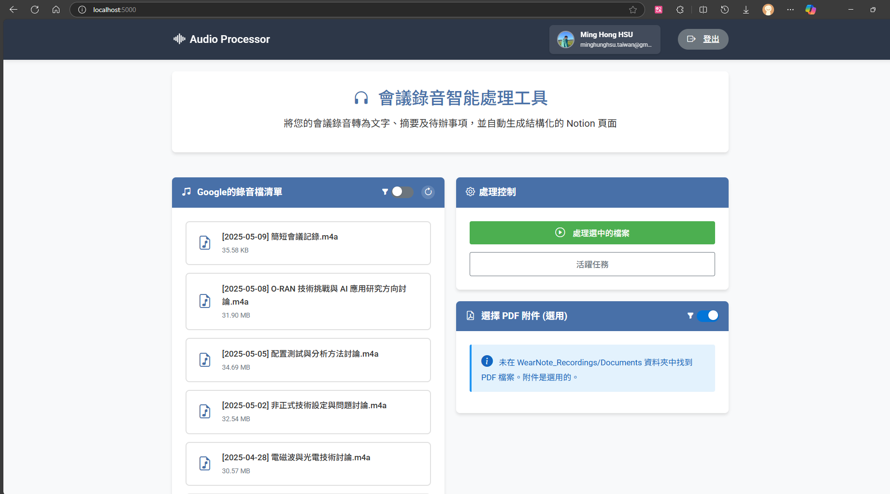
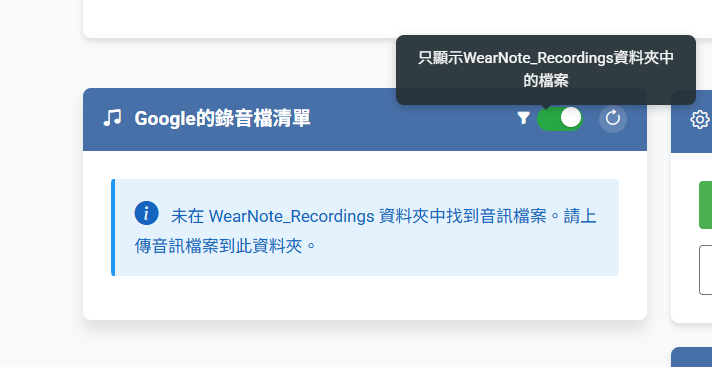

# Audio Processing API

This Flask application processes audio files from Google Drive, performs speech-to-text transcription and speaker diarization, attempts to identify speakers, generates a summary and to-do list using Google Gemini, optionally incorporates text from a PDF attachment, and creates a summary page in Notion.


## Features

*   Downloads audio files from Google Drive.
*   Converts various audio formats to WAV (16kHz, mono).
*   Performs speech-to-text using Whisper.
*   Performs speaker diarization using Pyannote Audio.
*   Attempts to identify speaker names (e.g., `SPEAKER_00`) based on conversation context using Google Gemini (`gemini-2.5-pro-exp-03-25`).
*   Generates a meeting title, summary, and to-do list using Google Gemini (`gemini-2.5-pro-exp-03-25`).
*   Optionally extracts text from a PDF attachment (via Google Drive) to provide more context to Gemini for summarization.
*   Creates a structured page in a specified Notion database with the title, summary, to-dos, and full transcript (without timestamps, using identified speaker names).
*   **NEW**: Multi-threaded processing with job queue for handling multiple requests simultaneously.
*   **NEW**: Audio preprocessing to remove silence and improve processing efficiency.
*   **NEW**: Automatic file renaming on Google Drive based on generated titles.
*   **NEW**: Timestamped transcript entries in Notion output.
*   **NEW**: Google Drive links included in the Notion page.
*   **NEW**: Job status tracking and progress monitoring APIs.
*   **Intelligent File Management**: Automatically renames processed audio files in Google Drive using a standardized format `[YYYY-MM-DD] Title.m4a` where the date is extracted from the original filename or defaults to the current date, and the title is generated from AI analysis.

## Documentation

For detailed information about the application's functionality and how to use it, please refer to the following documentation:

### API Documentation
- [API Reference](./docs/api/README.md) - Endpoints for processing files and checking job status

### Core Functionality
- [Asynchronous Processing](./docs/core/async_processing.md) - Job management and multi-threading
- [Audio Processing](./docs/core/audio_processing.md) - Audio file handling and transcription
- [AI Processing](./docs/core/ai_processing.md) - Speaker identification and summarization
- [External Integrations](./docs/core/external_integrations.md) - Google Drive and Notion integration

### Utility Functions
- [Helper Functions](./docs/utils/helper_functions.md) - Utility functions used by the application

For a quick overview of all documentation, see the [Documentation Overview](./docs/README.md).

## Detailed Workflow

For a detailed step-by-step explanation of the application's internal workflow and function interactions, please see the [**Process Details Document**](./PROCESS_DETAILS.md).

4. **Processing and Analysis**:
   - The audio file is processed by Whisper for speech-to-text transcription
   - Pyannote is used for speaker diarization (identifying different speakers)
   - Google Gemini AI identifies likely speaker identities
   - A title, summary, and to-do list are generated
   - The original audio file is renamed in Google Drive with the format `[YYYY-MM-DD] Title.m4a`
   - A comprehensive Notion page is created with all the information

## Prerequisites

*   Python 3.8+ (Python 3.10 used in Dockerfile)
*   Docker & Docker Compose (Version 1.x might require multi-step updates, see below)
*   Google Cloud Project with Drive API enabled
    *   OAuth 2.0 Credentials (`credentials.json`) OR Service Account Key (`service_account.json`)
    *   Drive API requires both read and write permissions
*   Google Gemini API Key
*   Hugging Face Hub Token (for Pyannote)
*   Notion Integration Token and Database ID

## Setup

1.  **Clone the repository:**
    ```bash
    git clone <your-repo-url>
    cd audio-processor
    ```
2.  **Create `.env` file:**
    Copy `.env.example` to `.env` (if it exists, otherwise create it) and fill in your credentials and IDs:
    ```env
    # Google Drive API
    # Option 1: OAuth (set USE_SERVICE_ACCOUNT=false)
    # GOOGLE_CREDS_JSON_PATH=./credentials.json # Path inside container is /app/credentials/credentials.json
    # Option 2: Service Account (set USE_SERVICE_ACCOUNT=true)
    GOOGLE_SA_JSON_PATH=/app/credentials/service_account.json # Use path inside container
    USE_SERVICE_ACCOUNT=true # Set to true or false

    # Google Gemini API
    GEMINI_API_KEY=YOUR_GEMINI_API_KEY

    # Hugging Face Hub (for Pyannote)
    HF_TOKEN=YOUR_HUGGINGFACE_TOKEN

    # Notion API
    NOTION_TOKEN=YOUR_NOTION_INTEGRATION_TOKEN
    NOTION_DATABASE_ID=YOUR_NOTION_DATABASE_ID

    # Flask Settings (Optional)
    PORT=5000
    FLASK_DEBUG=false
    ```
3.  **Place Credentials:**
    *   Create a `credentials` directory in your project root: `mkdir credentials`
    *   Place your Google credentials file (`credentials.json` or `service_account.json`) inside this `credentials` directory. **Ensure the filename matches the one specified in `.env` (e.g., `service_account.json`).**
4.  **Build and Run with Docker Compose:**
    ```bash
    # Build the image initially
    docker-compose build audio-processor
    # Start the service in detached mode
    docker-compose up -d
    ```
    *(This assumes your service in `docker-compose.yml` is named `audio-processor`)*

## API Usage

### Submit Processing Job

Send a POST request to the `/process` endpoint to start asynchronous processing.

**Endpoint:** `POST /process`

**Headers:**
*   `Content-Type: application/json`

**Body (JSON):**
```json
{
  "file_id": "YOUR_GOOGLE_DRIVE_AUDIO_FILE_ID",
  "attachment_file_id": "OPTIONAL_GOOGLE_DRIVE_PDF_FILE_ID"
}
```
*   `file_id`: (Required) The ID of the audio file in Google Drive.
*   `attachment_file_id`: (Optional) The ID of a PDF file in Google Drive to include as context for summarization.

**Example Request (using curl):**
```bash
curl -X POST http://localhost:5000/process \
-H "Content-Type: application/json" \
-d '{
      "file_id": "YOUR_AUDIO_FILE_ID",
      "attachment_file_id": "YOUR_PDF_FILE_ID"
    }'
```

**Success Response (200 OK):**
```json
{
  "success": true,
  "message": "Job submitted, processing in background",
  "job_id": "12345678-1234-5678-1234-567812345678"
}
```

### Check Job Status

Send a GET request to the `/job/<job_id>` endpoint to check processing status.

**Endpoint:** `GET /job/<job_id>`

**Example Request:**
```bash
curl http://localhost:5000/job/12345678-1234-5678-1234-567812345678
```

**Success Response (Job in Progress):**
```json
{
  "success": true,
  "job": {
    "id": "12345678-1234-5678-1234-567812345678",
    "status": "processing",
    "progress": 65,
    "created_at": "2023-06-10T12:34:56.789012",
    "updated_at": "2023-06-10T12:35:23.456789"
  }
}
```

**Success Response (Job Completed):**
```json
{
  "success": true,
  "job": {
    "id": "12345678-1234-5678-1234-567812345678",
    "status": "completed",
    "progress": 100,
    "created_at": "2023-06-10T12:34:56.789012",
    "updated_at": "2023-06-10T12:38:45.123456",
    "result": {
      "success": true,
      "notion_page_id": "xxxxxxxx-xxxx-xxxx-xxxx-xxxxxxxxxxxx",
      "notion_page_url": "https://www.notion.so/xxxxxxxxxxxxxxxxxxxxxxxxxxxxxxxx",
      "title": "Generated Meeting Title",
      "summary": "Generated meeting summary...",
      "todos": ["Generated Todo 1", "Generated Todo 2"],
      "identified_speakers": {"SPEAKER_00": "Alice", "SPEAKER_01": "Bob"},
      "drive_filename": "[2023-06-10] Generated Meeting Title"
    }
  }
}
```

### List Jobs

Send a GET request to the `/jobs` endpoint to get a list of jobs with optional filtering.

**Endpoint:** `GET /jobs`

**Query Parameters:**
- `filter`: (Optional) Filter jobs by status
  - `active`: Only pending or processing jobs (default)
  - `all`: All jobs regardless of status
  - `completed`: Only completed jobs
  - `failed`: Only failed jobs

**Example Requests:**

List active jobs (default):
```bash
curl http://localhost:5000/jobs
```

List all jobs:
```bash
curl http://localhost:5000/jobs?filter=all
```

List only completed jobs:
```bash
curl http://localhost:5000/jobs?filter=completed
```

List only failed jobs:
```bash
curl http://localhost:5000/jobs?filter=failed
```

**Success Response:**
```json
{
  "success": true,
  "active_jobs": {
    "12345678-1234-5678-1234-567812345678": {
      "id": "12345678-1234-5678-1234-567812345678",
      "status": "processing",
      "progress": 65,
      "created_at": "2023-06-10T12:34:56.789012",
      "updated_at": "2023-06-10T12:35:23.456789"
    },
    "87654321-4321-5678-4321-876543210987": {
      "id": "87654321-4321-5678-4321-876543210987",
      "status": "pending",
      "progress": 0,
      "created_at": "2023-06-10T12:38:00.123456",
      "updated_at": "2023-06-10T12:38:00.123456"
    }
  },
  "count": 2,
  "timestamp": "2023-06-10T12:38:10.123456"
}
```

### Health Check

A health check endpoint is available that also shows the number of active jobs:

**Endpoint:** `GET /health`

**Response:**
```json
{
  "status": "healthy",
  "timestamp": "2023-06-10T12:38:00.123456",
  "active_jobs": 2
}
```

### Cancel Job

Send a POST request to the `/job/<job_id>/cancel` endpoint to cancel a running or pending job.

**Endpoint:** `POST /job/<job_id>/cancel`

**Example Request:**
```bash
curl -X POST http://localhost:5000/job/12345678-1234-5678-1234-567812345678/cancel
```

**Success Response:**
```json
{
  "success": true,
  "message": "任務取消請求已提交"
}
```

**Error Response (Job Not Found):**
```json
{
  "success": false,
  "error": "任務不存在"
}
```

**Error Response (Job Cannot Be Cancelled):**
```json
{
  "success": false,
  "error": "任務已完成或失敗，無法取消"
}
```

## Updating the Application

A management script `manage_service.sh` is provided to simplify common operations with the Docker service.

### Using the Management Script

Make the script executable if it isn't already:
```bash
chmod +x ./manage_service.sh
```

Available commands:

- **Start the service:**
  ```bash
  ./manage_service.sh start
  ```

- **Stop the service:**
  ```bash
  ./manage_service.sh stop
  ```

- **Update the application** (after code changes):
  ```bash
  ./manage_service.sh update
  ```
  This command handles stopping, removing, rebuilding, and restarting the service in one step, avoiding potential issues with Docker Compose version incompatibilities.

- **View logs** (with continuous following like `tail -f`):
  ```bash
  ./manage_service.sh logs
  ```

- **Check service status:**
  ```bash
  ./manage_service.sh status
  ```

- **Clean up unused Docker images:**
  ```bash
  ./manage_service.sh clean
  ```

### Manual Update Process

If you prefer not to use the script, you can manually update the application when you modify the Python code by following these steps:

1. Stop the service: `docker-compose stop audio-processor`
2. Remove the container: `docker-compose rm -f audio-processor`
3. Rebuild the image: `docker-compose build audio-processor`
4. Start the service: `docker-compose up -d`
5. View logs: `docker-compose logs -f audio-processor`

This explicit step-by-step process avoids potential issues with some Docker Compose versions (particularly 1.x) that can cause errors like `KeyError: 'ContainerConfig'` when using simpler commands like `docker-compose up -d --build`.

### Quick Update Command

For convenience, you can use this one-liner to update the application:

```bash
docker-compose stop audio-processor && docker-compose rm -f audio-processor && docker-compose build audio-processor && docker-compose up -d && docker-compose logs -f audio-processor
```

## Additional Dependencies

The enhanced version requires these additional Python packages:
```
numpy
librosa
soundfile
```

You may need to add these to your Dockerfile or requirements.txt file if they're not already included.

## Cleaning Up Unused Docker Images

Each time you rebuild the image after making changes (`docker-compose build audio-processor`), Docker keeps the old, unused image layers. Over time, these can consume significant disk space.

To remove all dangling (unused and untagged) images, you can use the `docker image prune` command.

```bash
# Remove all dangling images
docker image prune

# To remove dangling images without prompting for confirmation
docker image prune -f
```

**Caution:** This command removes images that are not associated with any container. Ensure you don't have other projects relying on these dangling images before running it. It's generally safe to run if you only use Docker for this project or manage your images carefully.
